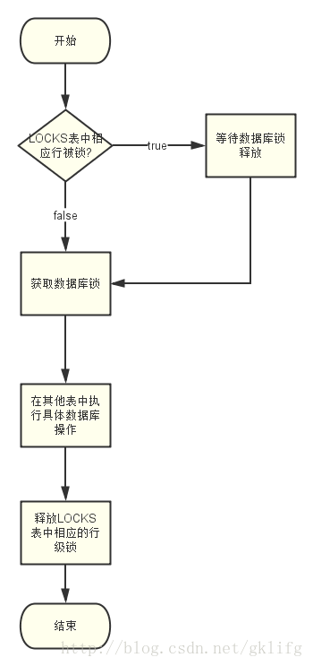

# quartz调研

quratz是目前最为成熟,使用最广泛的**Java**任务调度框架,功能强大配置灵活.在企业应用中占重要地位.quratz在集群环境中的使用方式是每个企业级系统都要考虑的问题.

后来有人总结了三种quratz集群方案:

1.单独启动一个Job Server来跑job，不部署在web容器中.其他web节点当需要启动异步任务的时候，可以通过种种方式\(DB, JMS, Web Service, etc\)通知Job Server，而Job Server收到这个通知之后，把异步任务加载到自己的任务队列中去。

2.独立出一个job server，这个server上跑一个spring+quartz的应用，这个应用专门用来启动任务。在jobserver上加上hessain，得到业务接口，这样jobserver就可以调用web Container中的业务操作，也就是正真执行任务的还是在cluster中的tomcat。在jobserver启动定时任务之后，轮流调用各地址上的业务操作（类似apache分发tomcat一样），这样可以让不同的定时任务在不同的节点上运行，减低了一台某个node的压力

3.quartz本身事实上也是支持集群的。在这种方案下，cluster上的每一个node都在跑quartz，然后也是通过数据中记录的状态来判断这个操作是否正在执行，这就要求cluster上所有的node的时间应该是一样的。而且每一个node都跑应用就意味着每一个node都需要有自己的线程池来跑quartz.

总的来说,第一种方法,在单独的server上执行任务,对任务的适用范围有很大的限制,要访问在web环境中的各种资源非常麻烦.但是集中式的管理容易从架构上规避了分布式环境的种种同步问题.第二种方法在在第一种方法的基础上减轻了jobserver的重量,只发送调用请求,不直接执行任务,这样解决了独立server无法访问web环境的问题,而且可以做到节点的轮询.可以有效地均衡负载.第三种方案是quartz自身支持的集群方案,在架构上完全是分布式的,没有集中的管理,quratz通过数据库锁以及标识字段保证多个节点对任务不重复获取,并且有负载平衡机制和容错机制,用少量的冗余,换取了高可用性\(high avilable HA\)和高可靠性.\(个人认为和Git的机制有异曲同工之处,分布式的冗余设计,换取可靠性和速度\).

# quartz集群架构

quartz的分布式架构如上图,可以看到数据库是各节点上调度器的枢纽.各个节点并不感知其他节点的存在,只是通过数据库来进行间接的沟通.

实际上,quartz的分布式策略就是一种以数据库作为边界资源的并发策略.每个节点都遵守相同的操作规范,使得对数据库的操作可以串行执行.而不同名称的调度器又可以互不影响的并行运行.


规则流程



其采用悲观锁的方式

```
public static final String SELECT_FOR_LOCK = "SELECT * FROM "
            + TABLE_PREFIX_SUBST + TABLE_LOCKS + " WHERE " + COL_SCHEDULER_NAME + " = " + SCHED_NAME_SUBST
            + " AND " + COL_LOCK_NAME + " = ? FOR UPDATE";

    public static final String INSERT_LOCK = "INSERT INTO "
        + TABLE_PREFIX_SUBST + TABLE_LOCKS + "(" + COL_SCHEDULER_NAME + ", " + COL_LOCK_NAME + ") VALUES (" 
        + SCHED_NAME_SUBST + ", ?)"; 

```

可以看出采用了悲观锁的方式对triggers表进行行加锁， 以保证任务同步的正确性。 

 

 当线程使用上述的SQL对表中的数据执行操作时，数据库对该行进行行加锁； 于此同时， 另一个线程对该行数据执行操作前需要获取锁， 而此时已被占用， 那么这个线程就只能等待， 直到该行锁被释放。 


